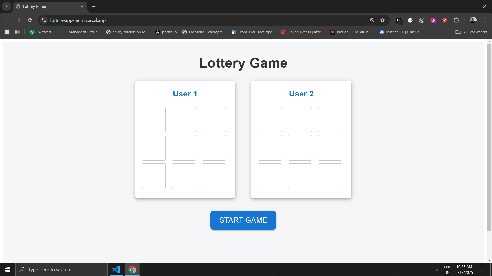
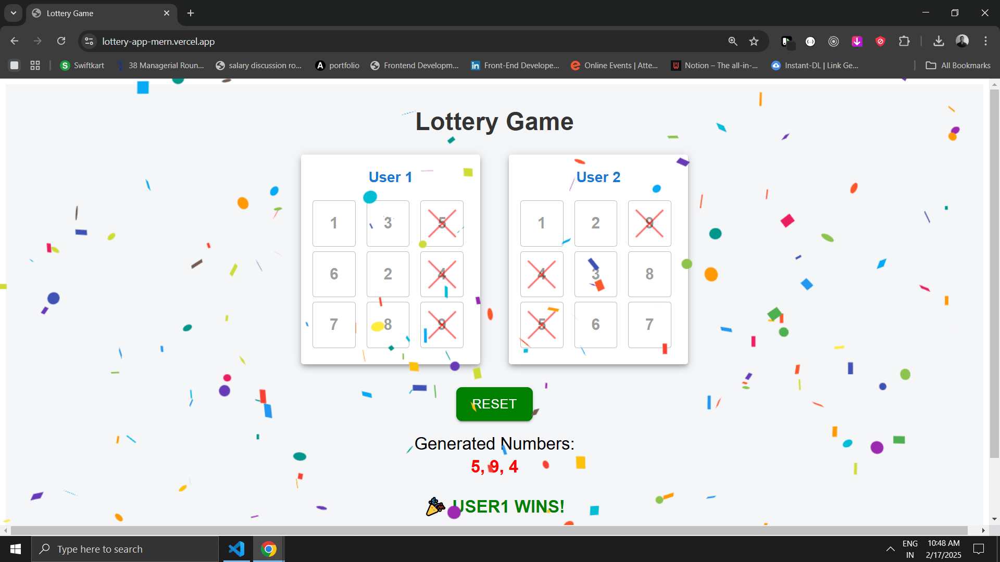

# 🎲 Lottery Game (MERN Stack)

A real-time lottery game built with **MongoDB, Express.js, React, and Node.js (MERN)**. Users can create a 3x3 grid, play with random number selection, and get real-time updates using **Socket.IO**.

## 🔗 Live Demo  

[🎮 Play the Game](https://lottery-app-mern.vercel.app){:target="_blank"}

## 🚀 Features

- **User-defined 3x3 grid** (Numbers 1-9, no duplicates).  
- **Real-time gameplay** using **Socket.IO**.  
- **Automatic number selection** every second.  
- **Win condition:** First to complete a row or column wins!  
- **Live updates** and instant winner announcement.  
- **Confetti animation** on winning.  

## 🛠 Tech Stack

- **Frontend:** React, Vite, MUI, Axios.  
- **Backend:** Node.js, Express.js, MongoDB, Socket.IO.  
- **Database:** MongoDB Atlas.  
- **Deployment:** Vercel (Frontend), Render (Backend).  

---

## 📸 Screenshots  

### 🎮 Game Board  
 

### 🎮 Winner
  

